# FitFindr — Starter Kit

This starter kit contains everything you need to begin Project 2.

## What's Included

```
ai201-project2-fitfindr-starter/
├── data/
│   ├── listings.json          # 40 mock secondhand listings
│   └── wardrobe_schema.json   # Wardrobe format + example wardrobe
├── utils/
│   └── data_loader.py         # Helper functions for loading the data
├── planning.md                # Your planning template — fill this out first
└── requirements.txt           # Python dependencies
```

## Setup

**macOS / Linux:**
```bash
python -m venv .venv
source .venv/bin/activate
pip install -r requirements.txt
```

**Windows:**
```bash
python -m venv .venv
source .venv/Scripts/activate
pip install -r requirements.txt
```

Set your Groq API key in a `.env` file (get a free key at [console.groq.com](https://console.groq.com)):
```
GROQ_API_KEY=your_key_here
```

## The Mock Listings Dataset

`data/listings.json` contains 40 mock secondhand listings across categories (tops, bottoms, outerwear, shoes, accessories) and styles (vintage, y2k, grunge, cottagecore, streetwear, and more).

Each listing has: `id`, `title`, `description`, `category`, `style_tags`, `size`, `condition`, `price`, `colors`, `brand`, and `platform`.

Load it with:
```python
from utils.data_loader import load_listings
listings = load_listings()
```

## The Wardrobe Schema

`data/wardrobe_schema.json` defines the format your agent uses to represent a user's existing wardrobe. It includes:

- `schema`: field definitions for a wardrobe item
- `example_wardrobe`: a sample wardrobe with 10 items you can use for testing
- `empty_wardrobe`: a starting template for a new user

Load an example wardrobe with:
```python
from utils.data_loader import get_example_wardrobe
wardrobe = get_example_wardrobe()
```

## Tool Inventory

Your README submission must document each tool's name, inputs, and return value. **These must exactly match your actual function signatures in `tools.py`.** Your documented interfaces will be checked against your actual function signatures in `tools.py` — if the parameter count or types contradict what's in the code, you may not receive full credit for that tool.

### `search_listings(description, size, max_price)`

| Parameter | Type | Description |
|-----------|------|-------------|
| `description` | `str` | Natural-language description of the clothing item being searched |
| `size` | `str \| None` | Clothing size (e.g. `"M"`, `"L"`); `None` skips the size filter |
| `max_price` | `float \| None` | Maximum price budget; `None` skips the price filter |

**Returns:** A list of listing dicts from `data/listings.json` whose `title`/`description`/`style_tags` match the query and whose `size` and `price` fall within the given constraints. Returns an empty list if nothing matches.

---

### `suggest_outfit(new_item, wardrobe)`

| Parameter | Type | Description |
|-----------|------|-------------|
| `new_item` | `dict` | A listing dict (with `title`, `description`, `style_tags`, `colors`, `brand`, `size`) representing the item to build an outfit around |
| `wardrobe` | `dict` | A wardrobe dict following `wardrobe_schema.json`, with an `"items"` list of the user's existing clothes |

**Returns:** A natural-language string generated by an LLM describing how to pair `new_item` with wardrobe pieces. If the wardrobe is empty, returns general styling advice for `new_item` instead. Returns a string containing `"doesn't pair well"` when styles are fundamentally incompatible.

---

### `create_fit_card(outfit, new_item)`

| Parameter | Type | Description |
|-----------|------|-------------|
| `outfit` | `str` | The outfit suggestion string produced by `suggest_outfit()` |
| `new_item` | `dict` | The listing dict for the focal piece of the outfit |

**Returns:** A short, shareable social-media caption (1–2 sentences) spotlighting `new_item` and summarising the full look. Returns a string beginning with `"Error:"` if the input is empty or whitespace.

---

## Interaction Walkthrough

**User query:** "I'm looking for a vintage graphic tee under $30. I mostly wear baggy jeans and chunky sneakers. What's out there and how would I style it?"

**Step 1 — Tool called:**
- Tool: `search_listings`
- Input: `description="vintage graphic tee", size=None, max_price=30.0`
- Why this tool: The user described a specific item they want to buy with a price ceiling. This tool scans the listings dataset to find real secondhand options that match, returning structured listing data the rest of the agent can act on.
- Output: `[{"id": "...", "title": "Faded Band Tee", "price": 22, "platform": "Depop", "condition": "Good", "style_tags": ["vintage", "grunge"], "colors": ["black"], ...}]`

**Step 2 — Tool called:**
- Tool: `suggest_outfit`
- Input: `new_item=<Faded Band Tee dict>, wardrobe=<user's wardrobe>`
- Why this tool: With a concrete listing selected, the agent now needs to connect it to what the user already owns. `suggest_outfit` uses the LLM to match `style_tags`, `colors`, and `category` across the wardrobe and produce a cohesive outfit description.
- Output: `"Pair this faded band tee with your wide-leg jeans and platform Docs for a classic 90s grunge look. Roll the sleeves once and tuck the front corner slightly for shape."`

**Step 3 — Tool called:**
- Tool: `create_fit_card`
- Input: `outfit="Pair this faded band tee with your wide-leg jeans...", new_item=<Faded Band Tee dict>`
- Why this tool: The user asked how to style the find — a shareable caption wraps the look into something they can post directly to Instagram, completing the request.
- Output: `"thrifted this faded band tee off depop for $22 and honestly it was made for my wide-legs 🖤 full look in my stories"`

**Final output to user:**

From your search for a **vintage graphic tee** with a max budget of **\$30**, I found a **Faded Band Tee** for **\$22** from **Depop** in **Good Condition**!

This vintage tee pairs beautifully with your **wide-leg jeans** and **platform Docs** for a **classic 90s grunge look**. Try rolling the sleeves once and tucking the front corner slightly to reinforce the silhouette.

Here's a ready-to-post caption for your OOTD:
> *thrifted this faded band tee off depop for $22 and honestly it was made for my wide-legs 🖤 full look in my stories*

---

## Error Handling and Fail Points

| Tool | Failure mode | Agent response |
|------|-------------|----------------|
| `search_listings` | No listings match all filters (description + size + price) | `_find_close_matches()` re-calls `search_listings` without size/price filters to surface near-misses (up to 5). `_format_search_error()` lists them with a note about which constraint they failed, asks the user to refine their search, and sets `session["error"]`. No further tools are called. |
| `suggest_outfit` | Wardrobe is empty (`wardrobe["items"] == []`) | `suggest_outfit()` detects the empty wardrobe and asks the LLM for general styling advice instead of specific pairings. Returns that advice as a normal string — the session does **not** end early and `create_fit_card` is still called. |
| `suggest_outfit` | Styles are fundamentally incompatible (style mismatch) | The LLM returns the sentinel `STYLE_MISMATCH`. `suggest_outfit()` converts it to a user-friendly string containing `"doesn't pair well"`. `_is_outfit_failure()` catches it, sets `session["error"]`, and ends the session immediately — no retries. |
| `create_fit_card` | `outfit` input is empty or whitespace | `create_fit_card()` returns a string starting with `"Error:"`. `_is_fit_card_error()` detects it, sets `session["error"]` to that string, and ends the session. `suggest_outfit` is **not** retried for this case. |
| `create_fit_card` | `new_item` title is missing from `outfit_suggestion` (non-empty wardrobe only) | Caught by `_new_item_in_outfit()` inside the retry loop. `suggest_outfit` is retried up to `MAX_SUGGEST_ATTEMPTS = 3` total times. After all attempts are exhausted, `session["error"]` is set to an internal error message and the session ends. |

---

---

## Architecture

<!-- Draw a diagram of your agent showing how the components connect:
     User input → Planning Loop → Tools (search_listings, suggest_outfit, create_fit_card)
                                                                          ↕
                                                                   State / Session
     Show what triggers each tool, how state flows between them, and where error paths branch off.
     Use ASCII art or a Mermaid diagram (https://mermaid.js.org/syntax/flowchart.html).
     Do NOT embed an image — graders need to read your diagram directly in the file;
     an embedded image or screenshot cannot be evaluated.
     You'll share this diagram with an AI tool when asking it to implement
     the planning loop and each individual tool. -->

```mermaid
---
config:
  layout: dagre
---
flowchart TB
    Start(["User Provides Prompt"]) --> ParseLLM["_parse_query_llm():<br>LLM extracts description, size, max_price as JSON"]
    ParseLLM --> ParseOK{"LLM parse<br>succeeded?"}
    ParseOK -- No --> ParseRegex["_parse_query_regex():<br>regex fallback extraction"]
    ParseOK -- Yes --> Search
    ParseRegex --> Search["search_listings(description, size, max_price)<br>→ session['search_results']"]
    Search --> CheckSearch{"Results<br>empty?"}
    CheckSearch -- No --> SelectItem["selected_item = results[0]<br>→ session['selected_item']"]
    CheckSearch -- Yes --> FindClose["_find_close_matches():<br>re-search without size/price filters"]
    FindClose --> ErrorSearch["_format_search_error():<br>list close matches or report no description match<br>→ session['error']"]
    ErrorSearch --> EndSession1(["End Session"])

    SelectItem --> LoopStart(["Retry loop<br>attempt 1..MAX_SUGGEST_ATTEMPTS=3"])
    LoopStart --> SuggestOutfit["suggest_outfit(selected_item, wardrobe)<br>→ session['outfit_suggestion']"]

    SuggestOutfit --> WardrobeEmpty{"wardrobe['items']<br>empty?"}
    WardrobeEmpty -- Yes --> GenAdvice["LLM: general styling advice<br>(no specific wardrobe pairings)"]
    WardrobeEmpty -- No --> PairItems["LLM: pair new_item with wardrobe pieces<br>by style_tags → colors → category → notes"]

    GenAdvice --> CheckStyleMismatch
    PairItems --> CheckStyleMismatch{"Doesn't match style?"}
    CheckStyleMismatch -- Yes --> ErrorMismatch["session['error'] = style mismatch message"]
    ErrorMismatch --> EndSession2(["End Session"])
    CheckStyleMismatch -- No --> CheckWardrobeForTitle{"Wardrobe<br>not empty?"}

    CheckWardrobeForTitle -- No --> CreateFit
    CheckWardrobeForTitle -- Yes --> CheckTitle{"new_item title<br>in outfit_suggestion?"}
    CheckTitle -- Yes --> CreateFit
    CheckTitle -- No --> CheckAttempts{"Reached<br>MAX_SUGGEST_ATTEMPTS?"}
    CheckAttempts -- No --> LoopStart
    CheckAttempts -- Yes --> ErrorInternal["session['error'] = internal error message"]
    ErrorInternal --> EndSession3(["End Session"])

    CreateFit["create_fit_card(outfit_suggestion, selected_item)<br>→ session['fit_card']"]
    CreateFit --> CheckFitCard{"fit_card starts<br>with 'Error:'?"}
    CheckFitCard -- Yes --> ErrorFitCard["session['error'] = fit_card error string"]
    ErrorFitCard --> EndSession4(["End Session"])
    CheckFitCard -- No --> ReturnDesc["Return completed session<br>(fit_card, outfit_suggestion, selected_item)"]
    ReturnDesc --> EndSession5(["End Session — SUCCESS"])

    Start:::startEnd
    ParseLLM:::processNode
    ParseOK:::decisionNode
    ParseRegex:::processNode
    Search:::processNode
    CheckSearch:::decisionNode
    SelectItem:::processNode
    FindClose:::processNode
    ErrorSearch:::errorNode
    EndSession1:::startEnd
    LoopStart:::startEnd
    SuggestOutfit:::processNode
    WardrobeEmpty:::decisionNode
    GenAdvice:::processNode
    PairItems:::processNode
    CheckStyleMismatch:::decisionNode
    ErrorMismatch:::errorNode
    EndSession2:::startEnd
    CheckWardrobeForTitle:::decisionNode
    CheckTitle:::decisionNode
    CheckAttempts:::decisionNode
    ErrorInternal:::errorNode
    EndSession3:::startEnd
    CreateFit:::processNode
    CheckFitCard:::decisionNode
    ErrorFitCard:::errorNode
    EndSession4:::startEnd
    ReturnDesc:::processNode
    EndSession5:::startEnd

    classDef processNode stroke:#818cf8,fill:#eef2ff
    classDef decisionNode stroke:#fb923c,fill:#fff7ed
    classDef errorNode stroke:#f87171,fill:#fef2f2
    classDef successNode stroke:#4ade80,fill:#f0fdf4
    classDef startEnd stroke:#a78bfa,fill:#f5f3ff
```


---

## Spec Reflection

<!-- Answer both questions with at least 2–3 sentences each. -->

**One way planning.md helped during implementation:** Filling in planning.md before coding helped me visualized how each user-agent interaction will play out with different scenarios, failure modes, and how state management works between each tool calls. The architecture diagram also visualize how each query runs. All of these information act as context for the LLM to help me implement these features 

**One divergence from your spec, and why:**
The spec initially didn't go into depth of how the arguments are parsed when the query is passed. When implementing the function, I have decided to go with a LLM-based approach, with using Reggex as a fallback mechanism. This ensures that each query will be parsed smoothly and flexibly with the use of a LLM. Using Reggex makes sure that the query will be parsed in case the LLM failed.

<!-- ---

## Where to Start

1. **Read `planning.md` and fill it out before writing any code.**
2. Verify the data loads correctly by running `python utils/data_loader.py`.
3. Build and test each tool individually before connecting them through your planning loop.

Your implementation files go in this same directory. There's no required file structure for your agent code — organize it however makes sense for your design. -->
