# FitFindr — planning.md

> Complete this document before writing any implementation code.
> Your spec and agent diagram are what you'll use to direct AI tools (Claude, Copilot, etc.) to generate your implementation — the more specific they are, the more useful the generated code will be.
> Your planning.md will be reviewed as part of your submission.
> Update it before starting any stretch features.

FitFindr will plan an outfit for you based on possible articles of clothing you want to buy! Give FitFindr a piece you want to wear, your existing wardrobe, and we'll coordinate an outfit for you based on the aesthetic you want to show today! Simple as that!

---

## Tools

List every tool your agent will use. For each tool, fill in all four fields.
You must have at least 3 tools. The three required tools are listed — add any additional tools below them.

### Tool 1: search_listings

**What it does:**
<!-- Describe what this tool does in 1–2 sentences -->
Search through `data\listings.json` to find an article of clothing with that matches a given description, with a given size and within a given budget.

**Input parameters:**
<!-- List each parameter, its type, and what it represents -->
- `description` (str): description of the clothing article the function is searching
- `size` (str): size of the article of clothing
- `max_price` (float): max price of the needed article of clothing 

**What it returns:**
<!-- Describe the return value — what fields does a result contain? -->
Returns one of the JSON entry within `data/listing.json` with a similar `description`, `size` and `price` that does not excedd `max_price`.

**What happens if it fails or returns nothing:**
<!-- What should the agent do if no listings match? -->
The agent should see if there's any article of clothing that *almost* match the criteria the function gave, e.g. check if there's an item with a similar `description` but in a different `size` or `price` that is higher than `max_price`. If that search gives no result, i.e. no entry with similar `description`, report back to the user without calling other tools, and do not come up with items and hallucinate.

---

### Tool 2: suggest_outfit

**What it does:**
<!-- Describe what this tool does in 1–2 sentences -->
Match a given article of clothing to some available pieces of clothes in the user's wardrobe.

**Input parameters:**
<!-- List each parameter, its type, and what it represents -->
- `new_item` (dict): a dictionary containing information about a new item of clothing: id, description, style tags, color, brand, size.
- `wardrobe` (dict): a dictionary containing information of items already within the wardrobe. Each item has the information: name, category, color, style tags.

**What it returns:**
<!-- Describe the return value -->
A natural-language suggestion generated by an LLM about possible pairings including the `new_item` and some items (possibly none) in `wardrobe`. The suggestion should point out the characteristics of the `new_item` and the matching items in `wardrobe`, and explain the look of the outfit and why it made that pairing.

**What happens if it fails or returns nothing:**
<!-- What should the agent do if the wardrobe is empty or no outfit can be suggested? -->
Check if `wardrobe` is empty. If it's empty, report back to use that `wardrobe` is empty and no pairings were made because of so, for clarification. If the `wardrobe` is not empty, that means that the function fails to pair the `new_item` with items in `wardrobe` to make a good and cohesive outfit. Report back to the user so, and explain that there are items in `wardrobe`, but the model failled to make an outfit using `new_item` and clothes in `wardrobe`.

---

### Tool 3: create_fit_card

**What it does:**
<!-- Describe what this tool does in 1–2 sentences -->
Create a short, sharable and memorable description about an outfit, likely for social media posts like Instagram.

**Input parameters:**
<!-- List each parameter, its type, and what it represents -->
- `outfit` (str): a description of a newly generated outfit by calling `suggest_outfit()`
- `new_item` (dict):  a dictionary containing information about a new item of clothing: id, description, style tags, color, brand, size.

**What it returns:**
<!-- Describe the return value -->
A short, sharable and memorable description about an outfit for social media posts. The description should highlight `new_item`, and quickly explain how it goes with other items in `outfit`.

**What happens if it fails or returns nothing:**
<!-- What should the agent do if the outfit data is incomplete? -->
Check if `new_item` is in `outfit`. If it's not, report to the user that `new_item` is not a part of `outfit`. If it still fails, or returns a nonsensical answer, check if the items within the outfits matches with `new_item`, or with another article of clothing within `outfits`. They may not go together.

---

### Additional Tools (if any)

<!-- Copy the block above for any tools beyond the required three -->

---

## Planning Loop

**How does your agent decide which tool to call next?**
<!-- Describe the logic your planning loop uses. What does it look at? What conditions change its behavior? How does it know when it's done? -->
*Context: Below describes the general loop the model uses to call relevant tools and resolve the query the user makes. It contains conditional cases and what the models do with relevant descriptions of tools' signatures. The tools' signatures are incomplete and are rather brief to give space for context to the logic loop, refer to Tools descriptions in the section above for the full definition of inputs, outputs and other descriptions.*

First, the agent receives the prompt from the user describing a piece of clothing they want to buy from `listings.json`, preferably with a particular `size` and `max_price` as the maximum budget. The agent parses the query using a two-phase strategy: it first tries an LLM-based parser (`_parse_query_llm`) that sends the query to the LLM and asks it to return structured JSON with `description`, `size`, and `max_price`. If that fails for any reason (bad JSON, empty description, network error), it falls back to a regex-based parser (`_parse_query_regex`) that extracts price and size using pattern matching and strips those tokens from the description. The result is stored in `session["parsed"]`. The model then should execute `search_listings(description, size, max_price)` to get results, which are matching articles of clothing the user can buy. Note that if the user didn't give `size` or `max_price`, or both, these are passed as `None` and the tool skips those filters.

After `search_listings()` was executed, check if the result was empty or not. The tool returns a list of matching listing dicts. If the result is not empty, set `selected_item = results[0]`, the top matching result, and store it in `session["selected_item"]`, then proceed to `suggest_outfit()`. If the result was empty, look for close matches by calling `search_listings(description, size=None, max_price=None)` and finding items that matched the description but failed the size or price constraints (up to 5). Store these in `session["close_matches"]`, set an error message in `session["error"]` (listing the close matches if any, or stating no description match), and return the session early without calling other tools.

If the session hasn't ended, enter a retry loop that runs up to `MAX_SUGGEST_ATTEMPTS = 3` times. In each iteration, call `suggest_outfit(new_item, wardrobe)`, where `new_item` is the selected item from `search_listings()` and `wardrobe` is the wardrobe dict passed into `run_agent()` by the caller. Store the attempt number in `session["suggest_attempts"]` and the result in `session["outfit_suggestion"]`.

`suggest_outfit()` handles the empty-wardrobe case internally: if `wardrobe["items"]` is empty, it asks the LLM for general styling advice rather than specific pairings, and returns that text (the session does NOT end early for an empty wardrobe). If the wardrobe is not empty, the LLM pairs `new_item` with wardrobe pieces by shared `style_tags`, `colors`, `category`, and `notes`; if styles are fundamentally incompatible, it returns the sentinel `STYLE_MISMATCH`.

After `suggest_outfit()` returns, check `_is_outfit_failure(outfit_suggestion)`. This returns `True` if the result is empty, whitespace-only, or contains any of the failure markers (`"doesn't pair well"`, `"does not pair well"`, `"no suitable outfit"`, `"STYLE_MISMATCH"`). If the outfit failed, set `session["error"]` and return the session immediately (no retry on a style mismatch).

If the outfit was generated successfully AND the wardrobe is not empty, check whether the `new_item`'s title appears in `outfit_suggestion` using `_new_item_in_outfit()`. If the title is missing and we have not yet exhausted `MAX_SUGGEST_ATTEMPTS`, skip the rest of the loop body and retry `suggest_outfit()`. If we have reached the maximum attempts, set `session["error"]` to an internal error message and return. (This check is skipped entirely when the wardrobe is empty, since general styling advice won't mention a specific title.)

If `outfit_suggestion` passes all checks, call `create_fit_card(outfit_suggestion, new_item)` and store the result in `session["fit_card"]`. If `create_fit_card()` returns a string starting with `"Error:"`, set `session["error"]` to that string and return. Otherwise the session is complete — return it with `session["error"] = None`.

---

## State Management

**How does information from one tool get passed to the next?**
<!-- Describe how your agent stores and accesses state within a session. What data is tracked? How is it passed between tool calls? -->
All state lives in the session dict initialized by `_new_session(query, wardrobe)` and returned at the end of `run_agent()`. The caller (e.g. `app.py`) passes in the `wardrobe` dict — either `get_example_wardrobe()` or `get_empty_wardrobe()` — the agent does NOT load it internally from disk.

Key fields and their flow:

| Field | Set when | Used by |
|-------|----------|---------|
| `query` | initialization | `_parse_query()` |
| `parsed` | after query parsing | `search_listings()` call |
| `search_results` | after `search_listings()` | close-match check and item selection |
| `selected_item` | `search_results[0]` | `suggest_outfit()`, `create_fit_card()`, UI output |
| `wardrobe` | initialization (passed in by caller) | `suggest_outfit()` |
| `outfit_suggestion` | after each `suggest_outfit()` call | `_is_outfit_failure()`, `_new_item_in_outfit()`, `create_fit_card()` |
| `fit_card` | after `create_fit_card()` | UI output |
| `error` | on any early exit | caller checks this first |
| `close_matches` | when `search_results` is empty | error message formatting |
| `suggest_attempts` | incremented each loop iteration | loop termination guard |
| `wardrobe_note` | reserved for empty-wardrobe note | UI output (prepended to outfit text if set) |

The tool call chain is: `search_listings()` → `session["selected_item"]` → `suggest_outfit()` → `session["outfit_suggestion"]` → `create_fit_card()` → `session["fit_card"]`.

---

## Error Handling

For each tool, describe the specific failure mode you're handling and what the agent does in response.

| Tool | Failure mode | Agent response |
|------|-------------|----------------|
| search_listings | No results match all criteria | `_find_close_matches()` re-calls `search_listings(description, size=None, max_price=None)` to find items that match the description but fail the size or price filter (up to 5). These are stored in `session["close_matches"]`. `_format_search_error()` formats a message listing them (with the specific size/price mismatch noted) and asks the user to refine their search, or reports that no description match exists at all. `session["error"]` is set and the session ends — no other tools are called. |
| suggest_outfit | Wardrobe is empty | `suggest_outfit()` detects `wardrobe["items"]` is empty and asks the LLM for general styling advice instead. It returns that advice as a normal string — the session does NOT end. The agent continues to `create_fit_card()`. The `wardrobe_note` field in the session is reserved to optionally prepend a note about the empty wardrobe to the UI output. |
| suggest_outfit | Can't pair outfit (style mismatch) | If the LLM detects fundamental style incompatibility it returns the sentinel `STYLE_MISMATCH`. `suggest_outfit()` converts this to a user-friendly string containing `"doesn't pair well"`. `_is_outfit_failure()` catches it, `session["error"]` is set, and the session ends immediately. |
| create_fit_card | Outfit input is empty or whitespace | `create_fit_card()` returns an error string starting with `"Error:"`. `_is_fit_card_error()` detects it, `session["error"]` is set to that string, and the session ends. `suggest_outfit()` is NOT retried for this case — retries are reserved for the `new_item` missing from outfit case (see Planning Loop). |
| create_fit_card | `new_item` title not in `outfit_suggestion` | Caught by `_new_item_in_outfit()` inside the retry loop (only when wardrobe is not empty). The loop retries `suggest_outfit()` for up to `MAX_SUGGEST_ATTEMPTS = 3` total attempts. After all attempts are exhausted, `session["error"]` is set to an internal error message and the session ends. |

---

## Architecture

<!-- Draw a diagram of your agent showing how the components connect:
     User input → Planning Loop → Tools (search_listings, suggest_outfit, create_fit_card)
                                                                          ↕
                                                                   State / Session
     Show what triggers each tool, how state flows between them, and where error paths branch off.
     Use ASCII art or a Mermaid diagram (https://mermaid.js.org/syntax/flowchart.html).
     Do NOT embed an image — graders need to read your diagram directly in the file;
     an embedded image or screenshot cannot be evaluated.
     You'll share this diagram with an AI tool when asking it to implement
     the planning loop and each individual tool. -->

```mermaid
---
config:
  layout: dagre
---
flowchart TB
    Start(["User Provides Prompt"]) --> ParseLLM["_parse_query_llm():<br>LLM extracts description, size, max_price as JSON"]
    ParseLLM --> ParseOK{"LLM parse<br>succeeded?"}
    ParseOK -- No --> ParseRegex["_parse_query_regex():<br>regex fallback extraction"]
    ParseOK -- Yes --> Search
    ParseRegex --> Search["search_listings(description, size, max_price)<br>→ session['search_results']"]
    Search --> CheckSearch{"Results<br>empty?"}
    CheckSearch -- No --> SelectItem["selected_item = results[0]<br>→ session['selected_item']"]
    CheckSearch -- Yes --> FindClose["_find_close_matches():<br>re-search without size/price filters"]
    FindClose --> ErrorSearch["_format_search_error():<br>list close matches or report no description match<br>→ session['error']"]
    ErrorSearch --> EndSession1(["End Session"])

    SelectItem --> LoopStart(["Retry loop<br>attempt 1..MAX_SUGGEST_ATTEMPTS=3"])
    LoopStart --> SuggestOutfit["suggest_outfit(selected_item, wardrobe)<br>→ session['outfit_suggestion']"]

    SuggestOutfit --> WardrobeEmpty{"wardrobe['items']<br>empty?"}
    WardrobeEmpty -- Yes --> GenAdvice["LLM: general styling advice<br>(no specific wardrobe pairings)"]
    WardrobeEmpty -- No --> PairItems["LLM: pair new_item with wardrobe pieces<br>by style_tags → colors → category → notes"]

    GenAdvice --> CheckStyleMismatch
    PairItems --> CheckStyleMismatch{"STYLE_MISMATCH<br>or outfit failure?"}
    CheckStyleMismatch -- Yes --> ErrorMismatch["session['error'] = style mismatch message"]
    ErrorMismatch --> EndSession2(["End Session"])
    CheckStyleMismatch -- No --> CheckWardrobeForTitle{"Wardrobe<br>not empty?"}

    CheckWardrobeForTitle -- No --> CreateFit
    CheckWardrobeForTitle -- Yes --> CheckTitle{"new_item title<br>in outfit_suggestion?"}
    CheckTitle -- Yes --> CreateFit
    CheckTitle -- No --> CheckAttempts{"Reached<br>MAX_SUGGEST_ATTEMPTS?"}
    CheckAttempts -- No --> LoopStart
    CheckAttempts -- Yes --> ErrorInternal["session['error'] = internal error message"]
    ErrorInternal --> EndSession3(["End Session"])

    CreateFit["create_fit_card(outfit_suggestion, selected_item)<br>→ session['fit_card']"]
    CreateFit --> CheckFitCard{"fit_card starts<br>with 'Error:'?"}
    CheckFitCard -- Yes --> ErrorFitCard["session['error'] = fit_card error string"]
    ErrorFitCard --> EndSession4(["End Session"])
    CheckFitCard -- No --> ReturnDesc["Return completed session<br>(fit_card, outfit_suggestion, selected_item)"]
    ReturnDesc --> EndSession5(["End Session — Success"])

    Start:::startEnd
    ParseLLM:::processNode
    ParseOK:::decisionNode
    ParseRegex:::processNode
    Search:::processNode
    CheckSearch:::decisionNode
    SelectItem:::processNode
    FindClose:::processNode
    ErrorSearch:::errorNode
    EndSession1:::startEnd
    LoopStart:::startEnd
    SuggestOutfit:::processNode
    WardrobeEmpty:::decisionNode
    GenAdvice:::processNode
    PairItems:::processNode
    CheckStyleMismatch:::decisionNode
    ErrorMismatch:::errorNode
    EndSession2:::startEnd
    CheckWardrobeForTitle:::decisionNode
    CheckTitle:::decisionNode
    CheckAttempts:::decisionNode
    ErrorInternal:::errorNode
    EndSession3:::startEnd
    CreateFit:::processNode
    CheckFitCard:::decisionNode
    ErrorFitCard:::errorNode
    EndSession4:::startEnd
    ReturnDesc:::processNode
    EndSession5:::startEnd

    classDef processNode stroke:#818cf8,fill:#eef2ff
    classDef decisionNode stroke:#fb923c,fill:#fff7ed
    classDef errorNode stroke:#f87171,fill:#fef2f2
    classDef successNode stroke:#4ade80,fill:#f0fdf4
    classDef startEnd stroke:#a78bfa,fill:#f5f3ff
```

---

## AI Tool Plan

<!-- For each part of the implementation below, describe:
     - Which AI tool you plan to use (Claude, Copilot, ChatGPT, etc.)
     - What you'll give it as input (which sections of this planning.md, your agent diagram)
     - What you expect it to produce
     - How you'll verify the output matches your spec before moving on

     "I'll use AI to help me code" is not a plan.
     "I'll give Claude my Tool 1 spec (inputs, return value, failure mode) and ask it to implement
     search_listings() using load_listings() from the data loader — then test it against 3 queries
     before trusting it" is a plan. -->

**Milestone 3 — Individual tool implementations:**
For each tool, I'll use Cursor to help me generate their implementation. I'll feed Cursor each tools' description section in planning.md (tool description, inputs, outputs, failure modes).

Before in

For `search_listings()`, Cursor must use the `load_listings()` method in `utils/data_loader.py` to load up clothes listings in `listings.json`. Before running the tool, I'll check the code to see if it filters clothes using `description`, `size`, `prize` to match the search criteria, and see if code handles empty result case. I'll test with 3 queries.

For `suggest_outfit()`, Cursor must use the `load_wardrobe_schema()` method in `utils/data_loader.py` to load up the wardrobe schema in `wardrobe_schema.json`. Cursor then can use `get_example_wardrobe()` and `get_empty_wardrobe()` within the same script to retrieve an an example wardrobe (default value for `wardrobe` argument) or empty wardrobe (use to check if `wardrobe` is empty). Before running the tool, I'll check the code to see if it suggest the outfit by getting clothes with similar `style_tags`, matching `colors`, `size`, and `category` to match with `new_item`, and see if code handles failure cases. I'll test with 3 queries.

For `create_fit_card()`, I'll check if Cursor handled the case where `new_item` is not mentioned in `outfit_description`. I'll check the code if it mentions `style_tags`, `colors` and aesthetic. I'll also check if it handles failure cases. I'll test with 3 queries. 

**Milestone 4 — Planning loop and state management:**
I'll use Cursor, and feed it information in the Planning Loop and State Management chunks in planning.md, with the Architecture diagram alongside with tools implementaions. I'll check the code to see if it handles every failure modes described in the Error Handling section appropriately with the Agent Response column. I'll check if the code stored information appropriately before and after each tool calls to see if data are inputed and outputed correctly in between interactions. I'll use 3 queries to check the cases where the agent needs clarifications from the user (e.g. when `search_listings()` suggest close matches but not exact matches).

---

## A Complete Interaction (Step by Step)

Write out what a full user interaction looks like from start to finish — tool call by tool call. Use a specific example query.

**Example user query:** "I'm looking for a vintage graphic tee under $30. I mostly wear baggy jeans and chunky sneakers. What's out there and how would I style it?"

**Step 1:**
<!-- What does the agent do first? Which tool is called? With what input? -->
*The agent will parse the user's query, and retrieve that `description = "vintage graphic tee"`, `max_price = 30`*
*The agent will then call the tool*
**Search listings: `search_listings(description="vintage graphic tee", max_price=30)`.**
*Note that size is empty since the query didn't mention sizes, this will fall back to the default value according to the tool's signatures*
*The result is: `new_item = <"Faded Band Tee — $22, Depop, Good condition.">`*

**Step 2:**
<!-- What happens next? What was returned from step 1? What tool is called now? -->
*The agent will use `new_item` and `wardrobe` to suggest a new outfit*
**Suggest appropriate outfit: `suggest_outfit(new_item=<band tee>, wardrobe=<user's wardrobe>)`**
*The result is: `outfit_description = "Pair this with your wide-leg jeans and platform Docs for a classic 90s grunge look. Roll the sleeves once and tuck the front corner slightly for shape."`*

**Step 3:**
<!-- Continue until the full interaction is complete -->
*The agent will use `outfit_description` with `new_item` to generate a fit card*
**Generate sharable fit card: `create_fit_card(outfit=outfit_description, new_item=<band tee>)`**
*The result is: `catchy_description = "thrifted this faded band tee off depop for $22 and honestly it was made for my wide-legs 🖤 full look in my stories"`*

**Final output to user:**
<!-- What does the user actually see at the end? -->
*The agent will introduce the suggested `new_item` from listings, show the user's `outfit_description` and `catchy_description` for social media posts*
From your search for a **Vintage Graphic T-shirt** with a max budget of **\$30**, I have looked into current clothes listings and found a ***Faded Band Tee*** for *\$22** from *Depop* in **Good Condition**!
This vintage tee should match with your **Wide-legged jeans** and **Platform Docs** for a ***Classic 90s Grunge Look!***. I suggest you should **roll up the sleeves once and tuck the front corner slightly to inforce the silhoutte**!.
You can use the following catchy, short description as a caption for your Instagram OOTD post!
*thrifted this faded band tee off depop for $22 and honestly it was made for my wide-legs 🖤 full look in my stories*

